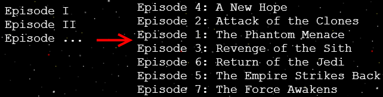
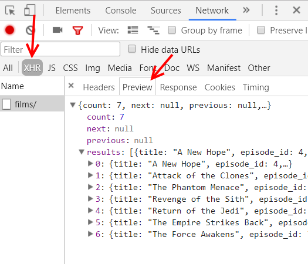

# Guerras Estelares :stars:

Baixe os [arquivos aqui][download]. Um página com as intros do melhores
filmes _ever_.

[download]: https://github.com/fegemo/cefet-front-end-starwars/archive/main.zip


## Atividade

Você deve usar a Star Wars API (http://swapi.dev) para poder (a) carregar
dinamicamente a lista de filmes e (b) também para exibir o respectivo texto
introdutório quando o usuário selecionar um filme.

A SWAPI (leia suópi) é um projeto de um cara chamado Paul Hallet e seu
irmão. Eles cadastraram várias informações sobre os filmes de Star Wars
em um banco de dados e as disponibilizou gratuitamente na forma
de um **serviço web** (uma API) para que outras pessoas pudessem criar
programas que usassem esses dados. Eles também criaram a [pokéapi][pokeapi],
com dados sobre Pokémon!

[pokeapi]: https://pokeapi.co/


### Exercício 0: rotacionando o texto (1 min)

Uma intro Star Wars só é uma intro Star Wars se o texto tiver uma rotação
no eixo X de `75deg`, é claro!

Portanto, coloque uma regra a mais no arquivo `estilos.css`:

```css
.container {
  transform: rotateX(75deg);
}
```


### Exercício 1 (**opcional**): incluindo jQuery (3 min)

Inclua a biblioteca jQuery (versão mais nova). Isso pode ser feito de
duas formas:

1. [Baixando a biblioteca][jquery-download] do site oficial; ou
1. Usando a biblioteca hospedada em uma CDN (_content delivery network_) -
   ou seja, de um site que hospeda bibliotecas JavaScript e permite que nós
   as incluamos no nosso
   - [CDNs que disponibilizam jQuery][jquery-cdns]

Lembre-se de incluir o arquivo **<u>antes</u> dos arquivos que vão
precisar de jQuery** (no caso, `starwars.js`).

Obs.: Professor, posso não usar jQuery? Veja o [FAQ](#faq)

[jquery-download]: http://jquery.com/download/#downloading-jquery
[jquery-cdns]: http://jquery.com/download/#using-jquery-with-a-cdn


### Exercício 2: buscando a lista de filmes com uma requisição Ajax (15 min)



Agora vamos fazer uma requisição Ajax e pegar lista de filmes Star Wars.
Com seu resultado em mãos, vamos preencher o
`<nav id="filmes"><ul>...</ul></nav>` para conter 01 `<li></li>` para
cada filme.

No arquivo `starwars.js`, faça uma chamada Ajax para a URL
`https://swapi.co/api/films/`. Assim que a resposta chegar, altere a página
para mostrar todos os filmes. Veja no [FAQ](#faq) se quiser lembrar como fazer.

Para saber o quê está sendo retornado na chamada Ajax, você pode:

1. Acessar a URL do navegador para ver a resposta; ou
1. (Mais legal ainda) Usar a ferramenta do desenvolvedor para ver
   a resposta da requisição

  

Deve ser criado um `<li>Episode x: titulo</li>` para cada filme
retornado, por exemplo: `<li>Episode 4: A New Hope</li>` -
descubra quais propriedades da resposta que você deve usar. Veja no
[FAQ](#faq) para lembrar como criar elementos dinamicamente, e como definir
o conteúdo HTML deles.

**Nota**: Não se preocupe se os filmes ficarem fora de ordem. Você pode
corrigir isso em um dos desafios.


### Exercício 3: alterando a intro para o filme clicado (15 min)

Faça com que, ao clicar em um filme (`<li data-id="x">...</li>`), uma função
_callback_ Ajax seja feita para pegar os detalhes desse filme e,
então, atualizar o texto introdutório.

**Sugestão**: altere o código do exercício 2 para colocar no `<li>nome</li>`,
um atributo de dados que contenha o _episode_id_ do filme, de forma que
fique assim:

```html
<li data-id-episodio="1">Episode 1: The Phantom Menace</li>
```

Ainda no código do exercício 2, coloque um evento de clique no
`<li>` recém-criado para fazer uma nova requisição Ajax para essa URL e,
assim que a resposta chegar, alterar o elemento `#intro` para ter um conteúdo
igual ao texto introdutório desse filme (descubra que propriedade usar,
olhando para a resposta).

Para ficar lindão, você deve colocar, antes do texto da introdução, os
escritos `"Episode X\n"` e `"O TITULO EM MAIÚSCULAS\n\n"`. Para saber como
passar todas as letras de uma string para maiúsculas, veja o [Faq](#faq).


### Desafio 1: ordenando os filmes (5 min)

Ordene os filmes de forma crescente de acordo com a propriedade `episode_id`.
Para isso, você pode usar [o método `vetor.sort()`][array-sort] que todo
vetor possui. Veja a [descrição do método na MDN][array-sort].

Como o vetor de filmes não tem uma ordenação natural (como
os números ou strings possuem), é necessário passar uma
função como parâmetro que será responsável por comparar
2 objetos de filmes. Veja na documentação da MDN como
implementar essa função.

A ideia é que a lista de filmes fique ordenada do episódio 1 até o último, em
ordem crescente.


### Desafio 2: usando algarismos romanos (2 min)

Em vez de colocar "Episode 1", coloque "Episode I" e daí por diante. Não
existe no JavaScript uma função para converter números romanos, mas você
pode criar um vetor de strings em que a posição `n` contém o algarismo
`n` em romano. Daí, em vez de usar o número, use a string na posição correta
do vetor.


### Desafio 3: trilha sonora (5 min)

Buscar e colocar um certo áudio na página - você sabe qual, Jovem Padawan!!!
É possível tocar um arquivo de música sem usar o elemento `<audio>...</audio>`,
usando apenas JavaScript:

```js
let audio = new Audio('arquivo-de-audio.mp3');
audio.play();
```

**Observação**: os navegadores não têm permitido mais que músicas comecem a
tocar em uma página antes de o usuário interagir com ela de alguma forma
(eg, clicando em algo). Portanto, coloque o código para tocar a música dentro
de alguma callback de _click_. Cuidado apenas para não começar a tocar a música
novamente, em caso de mais de 01 clique.


## FAQ

1. Posso <u>não</u> usar jQuery?
   - Pode sim! É legal porque aí você não fica preso a 01 biblioteca
     JavaScript em particular.
     1. Usar [XMLHttpRequest][ajax-vanilla-1] diretamente
     1. Usar [fetch][fetch-api] (+recente e preferível!!)
1. Como fazer uma requisição Ajax com jQuery?
   - Primeiramente, lembre-se de incluir o arquivo da biblioteca. Depois:
     ```js
     $.ajax(configuracoes);
     ```
     - Por exemplo:
       ```js
       $.ajax({
         url: 'url-da-requisicao',
         dataType: 'json',
         success: function(resposta) {
           // escreve a resposta no console (para ver o que foi recebido)
           console.log(resposta);
           // faz o que quiser fazer com a resposta...
           // ...
         }
       });
       ```
       - Veja mais nos slides sobre [Ajax com jQuery][ajax-jquery]
       - Se estiver sem jQuery, veja Ajax com _vanilla_ JS [1][ajax-vanilla-1]
         e [2][ajax-vanilla-2]
1. Como criar um elemento HMTL dinamicamente?
   - Usando jQuery:
     ```js
     $('<div></div>').appendTo(document.body);
     ```
   - Em _vanilla_ JS:
     ```js
     let novoEl = document.createElement('div');
     document.body.appendChild(novoEl);
     ```   
1. Como alterar o conteúdo HTML de um elemento?
   - Usando jQuery:
     ```js
     $('elemento').html('novo conteúdo do elemento');
     ```
   - Em _vanilla_ JS:
     ```js
     let elemento = document.querySelector('elemento');
     elemento.innerHTML = 'novo conteúdo do elemento';
     ```
1. O que é esse `"data-id-episodio"` em `<li data-id-episodio="...">...</li>`?
   - Em HTML, podemos "criar" novos atributos com o nome e o valor que quisermos
     - Tipicamente, damos o nome desses novos atributos de `data-algumacoisa`,
       para informar que ele é um atributo "de dados" e não um atributo
       padrão do HTML
     - Para recuperar o valor de um _data attribute_:
       ```html
       <button id="maroto" data-sorriso=":D">Me dê um sorriso</button>
       ```
       - Podemos, em _vanilla JS_:
         ```js
         let botaoEl = document.querySelector('#maroto');
         alert(botaoEl.dataset.sorriso);
         ```
       - Ou com jQuery:
         ```js
         let $botao = $('#maroto');
         alert($botao.data('sorriso'));
         ```
         - E para colocar um novo atributo de dados:
           ```js
           $botao.data('novo-atributo', 'o seu valor');
           ```
   - Neste caso, **uma ideia é colocar o id do filme** para conseguir
     recuperar os detalhes daquele episódio
     - Quando o elemento for "clicado", recuperar o id do `<li>` que foi alvo
       do evento de `click` e fazer uma busca no vetor de filmes procurando
       por aquele que tem o `id` solicitado
1. Como posso buscar um certo elemento dentro de um vetor?
   - Todo vetor possui o método `.find(funcao)` que recebe uma _callback_ como
     parâmetro e a invoca para cada elemento do array, passando o elemento atual
     como argumento. Essa _callback_ deve retornar `true` se o elemento atual
     é o elemento sendo buscado, ou `false`, do contrário. Por exemplo:
     ```js
     let frutas = ['kiwi', 'morango', 'tomate'];

     // quero encontrar a fruta cujo nome possui 4 letras
     let fruta4Letras = frutas.find(function(fruta) {
       return fruta.length === 4;
     });

     // imprime: 'kiwi'
     console.log(fruta4Letras);
     ```
     - Veja a documentação do [`.find()` na MDN][array-find]
1. Como colocar uma string em tudo maiúsculo?
   ```js
   'Uma palavra'.toUpperCase() === 'UMA PALAVRA';
   ```
1. O que é Ajax mesmo?
   - É uma forma de fazer uma requisição assíncrona para pegar alguma
     coisa a partir de uma URL. Veja mais sobre [Ajax nos slides][ajax].


[prototype]: http://prototypejs.org/
[mootools]: https://mootools.net/
[yui]: https://yuilibrary.com/
[setup-local-server]: https://fegemo.github.io/cefet-web/classes/js7/#setup-local-server
[ajax]: https://fegemo.github.io/cefet-front-end/classes/js7/#ajax
[ajax-jquery]: https://fegemo.github.io/cefet-front-end/classes/js7/#ajax-jquery
[ajax-vanilla-1]: https://fegemo.github.io/cefet-front-end/classes/js7/#ajax-vanilla-1
[ajax-vanilla-2]: https://fegemo.github.io/cefet-front-end/classes/js7/#ajax-vanilla-2
[array-sort]: https://developer.mozilla.org/pt-BR/docs/Web/JavaScript/Reference/Global_Objects/Array/sort
[array-find]: https://developer.mozilla.org/pt-BR/docs/Web/JavaScript/Reference/Global_Objects/Array/find
[fetch-api]: https://fegemo.github.io/cefet-front-end/classes/js7/#ajax-fetch